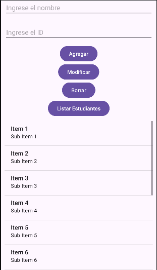

# SQL lite
Android incluye SQLite de forma nativa. Para usarlo, se extiende la clase `SQLiteOpenHelper`, que gestiona la creación y actualización de la base de datos.

> [!NOTE]
> Se necesita tres piezas para poder utilizarlo:
> - Contrato (nombres de tabla y columnas)
> - DatabaseHelper (crea/abre la BD)
> - Repositorio (operaciones CRUD)

```xml
```
```kt
```
```kt
```

ejemplo: 

activity_main.xml
```xml
<?xml version="1.0" encoding="utf-8"?>
<androidx.constraintlayout.widget.ConstraintLayout xmlns:android="http://schemas.android.com/apk/res/android"
    xmlns:app="http://schemas.android.com/apk/res-auto"
    xmlns:tools="http://schemas.android.com/tools"
    android:id="@+id/main"
    android:layout_width="match_parent"
    android:layout_height="match_parent"
    tools:context=".MainActivity">

    <LinearLayout
        android:layout_width="match_parent"
        android:layout_height="match_parent"
        android:orientation="vertical"
        android:gravity="center">

        <EditText
            android:id="@+id/nombre"
            android:layout_width="match_parent"
            android:layout_height="wrap_content"
            android:hint="Ingrese el nombre"
            android:layout_margin="10dp"
            />
        <EditText
            android:id="@+id/identificador"
            android:layout_width="match_parent"
            android:layout_height="wrap_content"
            android:hint="Ingrese el ID"
            android:inputType="number"
            android:layout_margin="10dp"
            />
        <Button
            android:id="@+id/agregar"
            android:layout_width="wrap_content"
            android:layout_height="wrap_content"
            android:text="Agregar"/>
        <Button
            android:id="@+id/modificar"
            android:layout_width="wrap_content"
            android:layout_height="wrap_content"
            android:text="Modificar"/>
        <Button
            android:id="@+id/borrar"
            android:layout_width="wrap_content"
            android:layout_height="wrap_content"
            android:text="Borrar"/>
        <Button
            android:id="@+id/listarEstudiantes"
            android:layout_width="wrap_content"
            android:layout_height="wrap_content"
            android:text="Listar Estudiantes"/>
        <ListView
            android:id="@+id/lista"
            android:layout_width="match_parent"
            android:layout_height="wrap_content"
            android:layout_margin="10dp"
            />
        <TextView
            android:id="@+id/mensaje"
            android:layout_width="wrap_content"
            android:layout_height="wrap_content"
            android:text="" />

    </LinearLayout>

</androidx.constraintlayout.widget.ConstraintLayout>
```
MainActivity.kt
```kt
package com.example.myapplication

import android.os.Bundle
import android.widget.Button
import android.widget.EditText
import android.widget.ListView
import android.widget.TextView
import androidx.activity.enableEdgeToEdge
import androidx.appcompat.app.AppCompatActivity

import android.database.sqlite.SQLiteDatabase
import android.widget.ArrayAdapter

class MainActivity : AppCompatActivity() {
    override fun onCreate(savedInstanceState: Bundle?) {
        super.onCreate(savedInstanceState)
        enableEdgeToEdge()
        setContentView(R.layout.activity_main)

        val nombre=findViewById<EditText>(R.id.nombre)
        val identificador=findViewById<EditText>(R.id.identificador)
        val agregar=findViewById<Button>(R.id.agregar)
        val modificar=findViewById<Button>(R.id.modificar)
        val borrar=findViewById<Button>(R.id.borrar)
        val listarEstudiantes=findViewById<Button>(R.id.listarEstudiantes)
        val listaview=findViewById<ListView>(R.id.lista)
        val mensaje=findViewById<TextView>(R.id.mensaje)


        val dbHelper = DBHelper(this)
        val db: SQLiteDatabase = dbHelper.writableDatabase

        // AGREGAR
        agregar.setOnClickListener {
            val id = identificador.text.toString().toIntOrNull()
            val nombre = nombre.text.toString()

            if (id != null && nombre.isNotEmpty()) {
                db.execSQL("INSERT INTO estudiantes (id, nombre) VALUES (?, ?)", arrayOf(id, nombre))
                mensaje.text = "Estudiante agregado: $nombre"
            } else {
                mensaje.text = "Ingrese datos válidos."
            }
        }

        // MODIFICAR
        modificar.setOnClickListener {
            val id = identificador.text.toString().toIntOrNull()
            val nombre = nombre.text.toString()

            if (id != null && nombre.isNotEmpty()) {
                db.execSQL("UPDATE estudiantes SET nombre=? WHERE id=?",arrayOf(nombre, id))
                mensaje.text = "Estudiante modificado: $nombre"
            } else {
                mensaje.text = "Ingrese datos válidos."
            }
        }

        // BORRAR
        borrar.setOnClickListener {
            val id = identificador.text.toString().toIntOrNull()

            if (id != null) {
                db.execSQL("DELETE FROM estudiantes WHERE id=?",arrayOf(id))
                mensaje.text = "Estudiante con ID $id eliminado."
            } else {
                mensaje.text = "Ingrese un ID válido."
            }
        }

        // LISTAR
        listarEstudiantes.setOnClickListener {
            val cursor = db.rawQuery("SELECT * FROM estudiantes", null)
            val lista = ArrayList<String>()

            if (cursor.moveToFirst()) {
                do {
                    val id = cursor.getInt(0)
                    val nombre = cursor.getString(1)
                    lista.add("ID: $id - Nombre: $nombre")
                } while (cursor.moveToNext())
            }

            cursor.close()

            if (lista.isEmpty()) {
                lista.add("No hay estudiantes registrados.")
            }

            val adapter = ArrayAdapter(this,android.R.layout.simple_list_item_1,lista)

            listaview.adapter = adapter
        }
    }
}
```
DBHelper.kt
```kt
package com.example.myapplication

import android.content.Context
import android.database.sqlite.SQLiteDatabase
import android.database.sqlite.SQLiteOpenHelper

class DBHelper(context: Context) : SQLiteOpenHelper(context,"EstudiantesDB",null,1) {

    override fun onCreate(db: SQLiteDatabase) {
        db.execSQL("CREATE TABLE estudiantes (id INTEGER PRIMARY KEY, nombre TEXT)")
    }

    override fun onUpgrade(db: SQLiteDatabase, oldVersion: Int, newVersion: Int) {
        db.execSQL("DROP TABLE IF EXISTS estudiantes")
        onCreate(db)
    }
}
```
