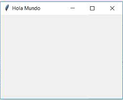
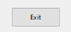
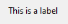
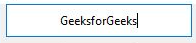
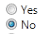
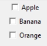
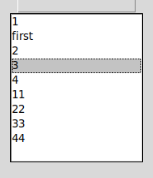

# Tkinter: Controles Básicos

## Interfaz gráfica tkinter


Son fundamentales cuando queremos implementar programas para usuarios finales que faciliten la entrada y salida de datos.

Para utilizar tkinter hay que importarlo:
```python
import tkinter as tk
```
`Importamos tkinter como tk ya que es mas facil escribir cada vez que se utiliza tk que  tkinter`

`La librería tkinter está codificada con la metodología de programación orientada a objetos. El módulo 'tkinter' tiene una clase llamada 'Tk' que representa una ventana.`

Este es un Hola Mundo en tkinter:
```python
import tkinter as tk

class Aplicacion:
    def __init__(self):
        self.ventana1=tk.Tk()    # se crea la ventano
        self.ventana1.title("Hola Mundo")    # se le da un titulo a la ventana
        self.ventana1.mainloop()    # para que se muestre la ventana en el monitor

# bloque principal
aplicacion1=Aplicacion()
```
## Control: Button y Label
button:  


label:  


```python
import tkinter as tk

class Aplicacion:
    def __init__(self):
        self.valor=1
        self.ventana1=tk.Tk()    # se crea la ventana
        self.ventana1.title("Controles Button y Label")    # se le da un titulo a la ventana
        self.label1=tk.Label(self.ventana1, text=self.valor)    # se crea un label, se le pasa la ventana que pertenece y se pasa el valor que tendra el texto
        self.label1.grid(column=0, row=0)    # mediante el grid se ajusta la posición del label
        self.label1.configure(foreground="red")    # se le asigna el texto de color rojo

        self.boton1=tk.Button(self.ventana1, text="Incrementar", command=self.incrementar)    # se crea uel boton1, se le pasa la ventana, el texto del botón y lo que se ejecutara al presionarlo
        self.boton1.grid(column=0, row=1)    # mediante grid se ajusta la posición del boton

        self.boton2=tk.Button(self.ventana1, text="Decrementar", command=self.decrementar)    # se crea uel boton2, se le pasa la ventana, el texto del botón y lo que se ejecutara al presionarlo
        self.boton2.grid(column=0, row=2)    # mediante grid se ajusta la posición del boton

        self.ventana1.mainloop()


    def incrementar(self):
        self.valor=self.valor+1
        self.label1.config(text=self.valor)    # se puede configurar un label despues de ser creado

    def decrementar(self):
        self.valor=self.valor-1
        self.label1.config(text=self.valor)        


aplicacion1=Aplicacion() 
```

Tambien se le puede poner un parametro de estado al button: state="disabled"

`La creación de los componentes se realizan dentro de __init__ ya que queremos que estos existan desde el principio.`
## Control: Entry


En tkinter el control de entrada de datos por teclado se llama Entry. Con este control aparece el típico recuadro que cuando se le da foco aparece el cursor en forma intermitente esperando que el operador escriba algo por teclado.

```python
import tkinter as tk

class Aplicacion:
    def __init__(self):
        self.ventana1=tk.Tk()
        self.label1=tk.Label(self.ventana1,text="Ingrese un número:")
        self.label1.grid(column=0, row=0)

        self.dato=tk.StringVar()        # para cargar una entrada es necesario crear un objeto para guardar la entrada
                                        # se crea de tipo string ya que las entry son de tipo string
        self.entry1=tk.Entry(self.ventana1, width=10, textvariable=self.dato)    # se crea un entry, se le pasa la ventana, el ancho del entry y en que variable se guardara la entrada
        self.entry1.grid(column=0, row=1)     mediante grid se ajusta la posición del entry

        self.boton1=tk.Button(self.ventana1, text="Calcular Cuadrado", command=self.calcularcuadrado)
        self.boton1.grid(column=0, row=2)
        self.label2=tk.Label(self.ventana1,text="resultado")
        self.label2.grid(column=0, row=3)
        self.ventana1.mainloop()

    def calcularcuadrado(self):
        valor=int(self.dato.get())    # para obtener el valor de la entrada se realiza mediante el metodo get() y se castea a un int
        cuadrado=valor*valor
        self.label2.configure(text=cuadrado)

aplicacion1=Aplicacion()   
```
## Control: Radiobutton


Otro control visual muy común es el Radiobutton que normalmente se muestran un conjunto de Radiobutton y permiten la selección de solo uno de ellos. Se los debe agrupar para que actúen en conjunto, es decir cuando se selecciona uno automáticamente se deben deseleccionar los otros.
```python
import tkinter as tk

class Aplicacion:
    def __init__(self):
        self.ventana1=tk.Tk()

# Definición del objeto de la clase IntVar que se encuentra en el módulo tk
        self.seleccion=tk.IntVar()
        self.seleccion.set(2) # se le da el valor de 2

# Definimos dos objetos de la clase Radiobutton e iniciamos el parámetro variable con la referencia de un objeto de la clase IntVar
        self.radio1=tk.Radiobutton(self.ventana1,text="Varon", variable=self.seleccion, value=1)     # se crea el radio1, se le pasa la ventana, el texto que tendra el radiob, la variable de seleccion y el valor del radiob
        self.radio1.grid(column=0, row=0)    # mediante grid se ubica el radiobutton
        self.radio2=tk.Radiobutton(self.ventana1,text="Mujer", variable=self.seleccion, value=2)
        self.radio2.grid(column=0, row=1)

        self.boton1=tk.Button(self.ventana1, text="Mostrar seleccionado", command=self.mostrarseleccionado)
        self.boton1.grid(column=0, row=2)
        self.label1=tk.Label(self.ventana1,text="opcion seleccionada")
        self.label1.grid(column=0, row=3)
        self.ventana1.mainloop()

    def mostrarseleccionado(self):
        if self.seleccion.get()==1:
            self.label1.configure(text="opcion seleccionada=Varon")
        if self.seleccion.get()==2:
            self.label1.configure(text="opcion seleccionada=Mujer")

aplicacion1=Aplicacion()
```
## Control: Checkbutton


El control visual Checkbutton permite implementar un botón de dos estados, más conocido como un cuadro de selección.
```python
import tkinter as tk

class Aplicacion:
    def __init__(self):
        self.ventana1=tk.Tk()

# A cada control de tipo Checkbutton lo asociamos con un objeto de la clase IntVar (por defecto el objeto de la clase IntVar almacena un cero indicando que el Checkbutton debe aparecer no seleccionado)
        self.seleccion1=tk.IntVar()
        self.check1=tk.Checkbutton(self.ventana1,text="Python", variable=self.seleccion1)
        self.check1.grid(column=0, row=0)

        self.seleccion2=tk.IntVar()
        self.check2=tk.Checkbutton(self.ventana1,text="C++", variable=self.seleccion2)
        self.check2.grid(column=0, row=1)
        self.seleccion3=tk.IntVar()
        self.check3=tk.Checkbutton(self.ventana1,text="Java", variable=self.seleccion3)
        self.check3.grid(column=0, row=2)
        self.boton1=tk.Button(self.ventana1, text="Verificar", command=self.verificar)
        self.boton1.grid(column=0, row=4)
        self.label1=tk.Label(self.ventana1,text="cantidad:")
        self.label1.grid(column=0, row=5)
        self.ventana1.mainloop()

# Cuando se presiona el botón se ejecuta el método 'verificar' donde analizamos que almacenan los objetos seleccion1, seleccion2 y seleccion3. En el caso de almacenar un 1 significa que el Checkbutton asociado está seleccionado
    def verificar(self):
        cant=0
        if self.seleccion1.get()==1:
            cant+=1
        if self.seleccion2.get()==1:
            cant+=1
        if self.seleccion3.get()==1:
            cant+=1
        self.label1.configure(text="cantidad:"+str(cant))


aplicacion1=Aplicacion()
```

`Tambien se le puede asignar al checkbutton command=self.cambiarestado (se ejecutara cada vez que se presione el check independiente del valor del checkbutton)`
## Control: Listbox


```python
import tkinter as tk

class Aplicacion:
    def __init__(self):
        self.ventana1=tk.Tk()

# Creamos un objeto de la clase Listbox, por defecto solo se puede seleccionar un único elemento
        self.listbox1=tk.Listbox(self.ventana1)
        self.listbox1.grid(column=0,row=0)

# Insertamos una serie de items en el Listbox mediante el método insert (indicamos en el primer parámetro la posición y en el segundo el valor a insertar)
        self.listbox1.insert(0,"papa")
        self.listbox1.insert(1,"manzana")
        self.listbox1.insert(2,"pera")
        self.listbox1.insert(3,"sandia")
        self.listbox1.insert(4,"naranja")
        self.listbox1.insert(5,"melon")
        self.boton1=tk.Button(self.ventana1, text="Recuperar", command=self.recuperar)
        self.boton1.grid(column=0, row=1)
        self.label1=tk.Label(self.ventana1,text="Seleccionado:")
        self.label1.grid(column=0, row=2)        
        self.ventana1.mainloop()

# Cuando se presiona el botón de recuperar mediante el método get recuperamos un item de la posición seleccionada
    def recuperar(self):
        if len(self.listbox1.curselection())!=0:
            self.label1.configure(text=self.listbox1.get(self.listbox1.curselection()[0]))

aplicacion1=Aplicacion()  
```
El método curselection retorna una tupla con todas las posiciones seleccionadas del Listbox. Como se trata de un Listbox que permite la selección de un único item luego por eso accedemos al item de la tupla de la posición 0.
