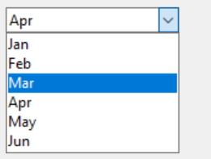
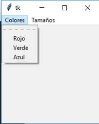
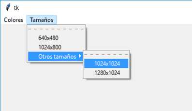
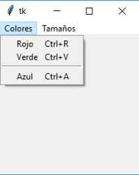
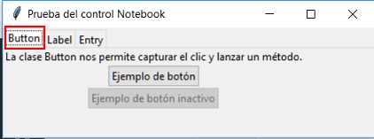
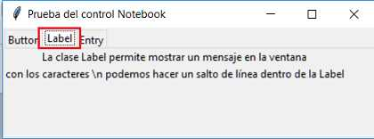
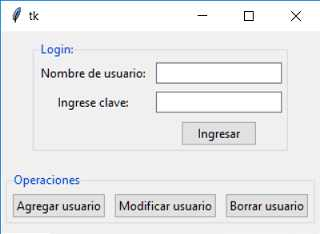
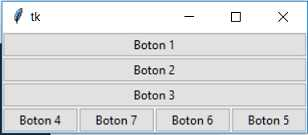
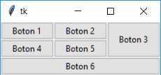
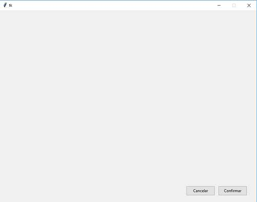

# tkinter y ttk (parte1)

## Módulo: ttk
En la versión Tk 8.5 sumó una nueva serie de controles visuales ( Notebook, Combobox etc.) y modernizó los conceptos anteriores. Para hacer uso de esta nueva versión de la biblioteca en Python se implementó un nuevo módulo y se lo agregó al paquete tkinter.

Para hacer uso de este conjunto de Widget (controles visuales) debemos importar el paquete ttk.
Se importa de la siguiente manera:
```python
from tkinter import ttk
```
```python
import tkinter as tk  # se debe seguir importando el paquete tkinter
from tkinter import ttk  # importamos el modulo ttk

class Aplicacion:
    def __init__(self):
        self.valor=1
        self.ventana1=tk.Tk()  # se sigue utilizando la clase Tk para crear la ventana
        self.ventana1.title("Controles Button y Label")

# El  cambio es que cada vez que debemos crear un control visual lo referenciamos del nuevo módulo ttk
        self.label1=ttk.Label(self.ventana1, text=self.valor)  # se referencia a ttk.Label
        self.label1.grid(column=0, row=0)
        self.label1.configure(foreground="red")

        self.boton1=ttk.Button(self.ventana1, text="Incrementar", command=self.incrementar)  # se referencia a ttk.Button
        self.boton1.grid(column=0, row=1)

        self.boton2=ttk.Button(self.ventana1, text="Decrementar", command=self.decrementar)  # se referencia a ttk.Button, antes se hacia a tk.Button
        self.boton2.grid(column=0, row=2)

        self.ventana1.mainloop()


    def incrementar(self):
        self.valor=self.valor+1
        self.label1.config(text=self.valor)

    def decrementar(self):
        self.valor=self.valor-1
        self.label1.config(text=self.valor)        


aplicacion1=Aplicacion()
```
Esto se puede hacer con:
Label:
```python
        self.label1=ttk.Label(self.ventana1, text=self.valor)
        self.label1.grid(column=0, row=0)
```
Button:
```python
        self.boton1=ttk.Button(self.ventana1, text="Ingresar", command=self.ingresar)
        self.boton1.grid(column=1, row=2)
```
Entry:
```python
        self.dato1=tk.StringVar()  # Es importante notar que los objetos de la clase StringVar pertenecen al paquete tkinter y no al nuevo paquete ttk
        self.entry1=ttk.Entry(self.ventana1, width=30, textvariable=self.dato1)
        self.entry1.grid(column=1, row=0)
```
Radiobutton:
```python
        self.seleccion=tk.IntVar()  # notar que IntVar pertenece al paquete tkinter
        self.seleccion.set(2)
        self.radio1=ttk.Radiobutton(self.ventana1,text="Varon", variable=self.seleccion, value=1)
        self.radio1.grid(column=0, row=0)
        self.radio2=ttk.Radiobutton(self.ventana1,text="Mujer", variable=self.seleccion, value=2)
        self.radio2.grid(column=0, row=1)
```
Checkbutton:
```python
        self.seleccion1=tk.IntVar()
        self.check1=ttk.Checkbutton(self.ventana1,text="Python", variable=self.seleccion1)
        self.check1.grid(column=0, row=0)

        self.seleccion2=tk.IntVar()
        self.check2=ttk.Checkbutton(self.ventana1,text="C++", variable=self.seleccion2)
        self.check2.grid(column=0, row=1)

        self.seleccion3=tk.IntVar()
        self.check3=ttk.Checkbutton(self.ventana1,text="Java", variable=self.seleccion3)
        self.check3.grid(column=0, row=2)
```
> [!CAUTION]
> El módulo ttk no implementa el Widget Listbox, pero podemos mezclar en una aplicación controles visuales de los dos paquetes.

`El modulo ttk más que todo cambia el diseño de los componentes a unos mas modernos`

## ttk: Control Combobox

El control Combobox del paquete ttk permite seleccionar un string de un conjunto de items que se despliegan.

> [!NOTE]
> Podemos indicar cual elemento muestre por defecto mediante el método 'current'.

> [!CAUTION]
> Por defecto el operador puede además de seleccionar un elemento cargar por teclado cualquier cadena.

```python
import tkinter as tk
from tkinter import ttk

class Aplicacion:
    def __init__(self):
        self.ventana1=tk.Tk()
        self.label1=ttk.Label(self.ventana1, text="Seleccione un día de la semana")
        self.label1.grid(column=0, row=0)

# Para crear un Combobox debemos hacer referencia al módulo ttk
        self.opcion=tk.StringVar()
        diassemana=("lunes","martes","miércoles","jueves","viernes","sábado","domingo")
        # se crea haciendo referencia al paquete ttk
        self.combobox1=ttk.Combobox(self.ventana1, width=10, textvariable=self.opcion, values=diassemana) # se le pasa la ventana, el ancho, donde se guardara lo seleccionado y la tupla de los valores que tendra
        self.combobox1.current(0)  # por defecto se selecciona la opcion de indice 0
        self.combobox1.grid(column=0, row=1)  # mediante grid se ubica el combobox

        self.boton1=tk.Button(self.ventana1, text="Recuperar", command=self.recuperar)
        self.boton1.grid(column=0, row=2)
        self.label2=ttk.Label(self.ventana1, text="Día seleccionado:")
        self.label2.grid(column=0, row=3)
        self.ventana1.mainloop()

    def recuperar(self):
        self.label2.configure(text=self.opcion.get())

aplicacion1=Aplicacion()
```
## tkinter: Control Menu

Para implementar los típicos menú de barra horizontales que aparecen en las aplicaciones cuando utilizamos la librería Tk necesitamos crear objetos de la clase Menu que se encuentra declarada en el paquete tkinter y no en el paquete tkinter.ttk.

ejemplo 1:


```python
import tkinter as tk  # importamos el modullo tkinter

class Aplicacion:
    def __init__(self):

# Luego de crear el objeto de la clase Tk procedemos a crear un objeto de la clase Menu y pasar como referencia la ventana
        self.ventana1=tk.Tk()
        menubar1 = tk.Menu(self.ventana1)

# Pasamos al parámetro menu de la ventana el objeto de la clase Menu que acabamos de crear (si no hacemos esto no aparecerá luego el menú de opciones
        self.ventana1.config(menu=menubar1)

# Creamos un segundo objeto de la clase Menu, pero en este caso le pasamos la referencia del primer objeto de la clase Menu que creamos, también añadimos las tres opciones que mostrará
        opciones1 = tk.Menu(menubar1)
        opciones1.add_command(label="Rojo", command=self.fijarrojo)
        opciones1.add_command(label="Verde", command=self.fijarverde)
        opciones1.add_command(label="Azul", command=self.fijarazul)

# Finalmente llamamos al método 'add_cascade' del menubar1 que creamos anteriormente indicando en el parámetro menu el otro objeto de la clase Menu
        menubar1.add_cascade(label="Colores", menu=opciones1)

# Segundo menu
        opciones2 = tk.Menu(menubar1)
        opciones2.add_command(label="640x480", command=self.ventanachica)
        opciones2.add_command(label="1024x800", command=self.ventanagrande)
        submenu1=tk.Menu(menubar1)
        submenu1.add_command(label="1024x1024", command=self.tamano1)
        submenu1.add_command(label="1280x1024", command=self.tamano2)        
        opciones2.add_cascade(label="Otros tamaños", menu= submenu1)        
        menubar1.add_cascade(label="Tamaños", menu=opciones2)        
        self.ventana1.mainloop()

    def fijarrojo(self):
        self.ventana1.configure(background="red")

    def fijarverde(self):
        self.ventana1.configure(background="green")

    def fijarazul(self):
        self.ventana1.configure(background="blue")

    def ventanachica(self):
        self.ventana1.geometry("640x480")

    def ventanagrande(self):
        self.ventana1.geometry("1024x800")

    def tamano1(self):
        self.ventana1.geometry("1024x1024")

    def tamano2(self):
        self.ventana1.geometry("1280x1024")

aplicacion1=Aplicacion()
```

ejemplo 2:




```python
import tkinter as tk

class Aplicacion:
    def __init__(self):
        self.ventana1=tk.Tk()  # se crea la ventana

        menubar1 = tk.Menu(self.ventana1)  # se crea el menu principal
        self.ventana1.config(menu=menubar1)  # se agrega el menu principal a la ventadna

        opciones1 = tk.Menu(menubar1, tearoff=0) # se crea el submenu opciones, se le pasa el menu al que pertenece y con tearoff=0 se desabilita el menu como barra
        opciones1.add_command(label="Rojo", command=self.fijarrojo, accelerator="Ctrl+R")  # se agrega a opciones un boton; se pasa el nombre, lo que se ejecutara al presionar y lo que mostrara el acortador
        opciones1.add_command(label="Verde", command=self.fijarverde, accelerator="Ctrl+V")
        opciones1.add_separator()        # podemos agregar lineas separadoras
        opciones1.add_command(label="Azul", command=self.fijarazul, accelerator="Ctrl+A")

        self.ventana1.bind_all("<Control-r>", self.cambiar)  # se crea para la ventana un acortador; se le pasa el comando y lo que se ejecutara en caso de ser presionado
        self.ventana1.bind_all("<Control-v>", self.cambiar)
        self.ventana1.bind_all("<Control-a>", self.cambiar)

        menubar1.add_cascade(label="Colores", menu=opciones1)  # se agrega al menu principal el menu opciones1 y se le da el combre Colores

        opciones2 = tk.Menu(menubar1)  # se crea el submenu opciones2, se le pasa el menu al que pertenece
        opciones2.add_command(label="640x480", command=self.ventanachica) # agrega un nuevo boton a opciones2; se indica el nombre y lo que se ejecutara en caso de ser presionado
        opciones2.add_command(label="1024x800", command=self.ventanagrande)
        menubar1.add_cascade(label="Tamaños", menu=opciones2)# se agrega el submenu al menu principal

        self.ventana1.mainloop()

    def cambiar(self, event):
        if event.keysym=="r":
            self.fijarrojo()
        if event.keysym=="v":
            self.fijarverde()
        if event.keysym=="a":
            self.fijarazul()

    def fijarrojo(self):
        self.ventana1.configure(background="red")

    def fijarverde(self):
        self.ventana1.configure(background="green")

    def fijarazul(self):
        self.ventana1.configure(background="blue")

    def ventanachica(self):
        self.ventana1.geometry("640x480")

    def ventanagrande(self):
        self.ventana1.geometry("1024x800")

aplicacion1=Aplicacion()
```

## ttk: Controles Notebook y Frame

La clase Notebook nos permite crear un cuaderno con una serie de pestañas en la parte superior. En cada pestaña asociamos un objeto de la clase Frame y dentro de esta podemos disponer distintos controles visuales que hemos visto hasta ahora como pueden ser Label, Button, Radiobutton, Checkbutton, Entry etc.

Segun la pestaña que se seleccione se muestra un frame con distintos controles visuales



```python
import tkinter as tk
from tkinter import ttk

class Aplicacion:
    def __init__(self):
        self.ventana1=tk.Tk()
        self.ventana1.title("Prueba del control Notebook")

# Creamos un objeto de la clase Notebook y le pasamos como referencia la ventana donde se mostrará
        self.cuaderno1 = ttk.Notebook(self.ventana1)

# Creamos un objeto de la clase Frame y le pasamos como referencia el objeto de la clase Notebook donde se insertará
        self.pagina1 = ttk.Frame(self.cuaderno1)

# Añadimos el objeto de la clase Frame que acabamos de crear con el nombre 'pagina1' en el objeto 'cuaderno1' y en la propiedad 'text' indicamos el texto que debe mostrar la pestaña
        self.cuaderno1.add(self.pagina1, text="Button")

# Creamos componentes para pagina1
        self.label1=ttk.Label(self.pagina1, text="La clase Button nos permite capturar el clic y lanzar un método.")
        self.label1.grid(column=0, row=0)
        self.boton1=ttk.Button(self.pagina1, text="Ejemplo de botón")
        self.boton1.grid(column=0, row=1)
        self.boton2=ttk.Button(self.pagina1, text="Ejemplo de botón inactivo", state="disabled")
        self.boton2.grid(column=0, row=2)

# Creamos pagina2
        self.pagina2 = ttk.Frame(self.cuaderno1)
        self.cuaderno1.add(self.pagina2, text="Label")
        self.label2=ttk.Label(self.pagina2, text="La clase Label permite mostrar un mensaje en la ventana")
        self.label2.grid(column=0, row=0)
        self.label3=ttk.Label(self.pagina2, text="con los caracteres \\n podemos hacer un salto de línea dentro de la Label")
        self.label3.grid(column=0, row=1)

# Creamos pagina3
        self.pagina3 = ttk.Frame(self.cuaderno1)
        self.cuaderno1.add(self.pagina3, text="Entry")
        self.label4=ttk.Label(self.pagina3, text="""En tkinter el control de entrada de datos por teclado se llama Entry.\n
Con este control aparece el típico recuadro que cuando se le da foco aparece el cursor en forma intermitente\n
esperando que el operador escriba algo por teclado.""")
        self.label4.grid(column=0, row=0)
        self.entry1=tk.Entry(self.pagina3, width=30)
        self.entry1.grid(column=0, row=1)

        self.cuaderno1.grid(column=0, row=0)        

        self.ventana1.mainloop()


aplicacion1=Aplicacion()
```

## ttk: Control LabelFrame


```python
import tkinter as tk
from tkinter import ttk

class Aplicacion:
    def __init__(self):
        self.ventana1=tk.Tk()

# se crea el labelframe con el texto Login
        self.labelframe1=ttk.LabelFrame(self.ventana1, text="Login")        
        self.labelframe1.grid(column=0, row=0, padx=5, pady=10)
# para no hacer esto mas largo la creacion de los componentes se realiza mediante el metodo login()
        self.login()
#se crea un segundo labelframe con el texto Operaciones
        self.labelframe2=ttk.LabelFrame(self.ventana1, text="Operaciones")        
        self.labelframe2.grid(column=0, row=1, padx=5, pady=10)        
        self.operaciones()
        self.ventana1.mainloop()

    def login(self):
        self.label1=ttk.Label(self.labelframe1, text="Nombre de usuario:") # notar que al crear los componentes se pasa el labelframe1 y no la ventana
        self.label1.grid(column=0, row=0, padx=4, pady=4)
        self.entry1=ttk.Entry(self.labelframe1)
        self.entry1.grid(column=1, row=0, padx=4, pady=4)
        self.label2=ttk.Label(self.labelframe1, text="Ingrese clave:")        
        self.label2.grid(column=0, row=1, padx=4, pady=4)
        self.entry2=ttk.Entry(self.labelframe1, show="*")
        self.entry2.grid(column=1, row=1, padx=4, pady=4)
        self.boton1=ttk.Button(self.labelframe1, text="Ingresar")
        self.boton1.grid(column=1, row=2, padx=4, pady=4)

    def operaciones(self):
        self.boton2=ttk.Button(self.labelframe2, text="Agregar usuario")  # notar que al crear los componentes se pasa el labelframe2 y no la ventana
        self.boton2.grid(column=0, row=0, padx=4, pady=4)
        self.boton3=ttk.Button(self.labelframe2, text="Modificar usuario")
        self.boton3.grid(column=1, row=0, padx=4, pady=4)
        self.boton4=ttk.Button(self.labelframe2, text="Borrar usuario")
        self.boton4.grid(column=2, row=0, padx=4, pady=4)

aplicacion1=Aplicacion()
```

## tkinter: Layout Manager (administrador de diseño)
En la librería GUI tkinter disponemos de tres Layout Manager para disponer controles dentro de una ventana:

- Pack


```python
import tkinter as tk
from tkinter import ttk

class Aplicacion:
    def __init__(self):
        self.ventana1=tk.Tk()
        self.boton1=ttk.Button(self.ventana1, text="Boton 1")
        self.boton1.pack(side=tk.TOP, fill=tk.BOTH)
        self.boton2=ttk.Button(self.ventana1, text="Boton 2")
        self.boton2.pack(side=tk.TOP, fill=tk.BOTH)
        self.boton3=ttk.Button(self.ventana1, text="Boton 3")
        self.boton3.pack(side=tk.TOP, fill=tk.BOTH)
        self.boton4=ttk.Button(self.ventana1, text="Boton 4")
        self.boton4.pack(side=tk.LEFT)
        self.boton5=ttk.Button(self.ventana1, text="Boton 5")
        self.boton5.pack(side=tk.RIGHT)
        self.boton6=ttk.Button(self.ventana1, text="Boton 6")
        self.boton6.pack(side=tk.RIGHT)
        self.boton7=ttk.Button(self.ventana1, text="Boton 7")
        self.boton7.pack(side=tk.RIGHT)
        self.ventana1.mainloop()

aplicacion1=Aplicacion()
```
- Grid


```python
import tkinter as tk
from tkinter import ttk

class Aplicacion:
    def __init__(self):
        self.ventana1=tk.Tk()
        self.boton1=ttk.Button(self.ventana1, text="Boton 1")
        self.boton1.pack(side=tk.TOP, fill=tk.BOTH, padx=5, pady=5)
        self.boton2=ttk.Button(self.ventana1, text="Boton 2")
        self.boton2.pack(side=tk.TOP, fill=tk.BOTH, padx=15, pady=15)
        self.boton3=ttk.Button(self.ventana1, text="Boton 3")
        self.boton3.pack(side=tk.TOP, fill=tk.BOTH, padx=25, pady=25)
        self.boton4=ttk.Button(self.ventana1, text="Boton 4")
        self.boton4.pack(side=tk.LEFT)
        self.boton5=ttk.Button(self.ventana1, text="Boton 5")
        self.boton5.pack(side=tk.RIGHT, padx=10)
        self.boton6=ttk.Button(self.ventana1, text="Boton 6")
        self.boton6.pack(side=tk.RIGHT)
        self.boton7=ttk.Button(self.ventana1, text="Boton 7")
        self.boton7.pack(side=tk.RIGHT)
        self.ventana1.mainloop()

aplicacion1=Aplicacion()
```
- Place


```python
import tkinter as tk
from tkinter import ttk

class Aplicacion:
    def __init__(self):
        self.ventana1=tk.Tk()
        self.boton1=ttk.Button(self.ventana1, text="Boton 1")
        self.boton1.grid(column=0, row=0)
        self.boton2=ttk.Button(self.ventana1, text="Boton 2")
        self.boton2.grid(column=1, row=0)
        self.boton3=ttk.Button(self.ventana1, text="Boton 3")
        self.boton3.grid(column=2, row=0, rowspan=2, sticky="ns")
        self.boton4=ttk.Button(self.ventana1, text="Boton 4")
        self.boton4.grid(column=0, row=1)
        self.boton5=ttk.Button(self.ventana1, text="Boton 5")
        self.boton5.grid(column=1, row=1)
        self.boton6=ttk.Button(self.ventana1, text="Boton 6")
        self.boton6.grid(column=0, row=2, columnspan=3, sticky="we")
        self.ventana1.mainloop()

aplicacion1=Aplicacion()
```
