# tkinter y ttk (parte2)

## tkinter: Messagebox
La librería tkinter provee un paquete llamado messagebox con una serie de funciones para la apertura de diálogos de información.

Para usar estos diálogos lo primero que debemos hacer es importar el paquete:
```python
from tkinter import messagebox as mb
```
ejemplo:

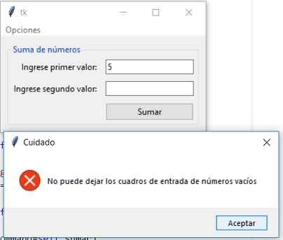
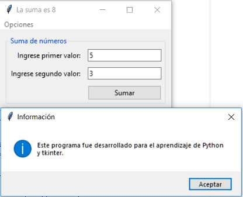

```python
import tkinter as tk
from tkinter import ttk
from tkinter import messagebox as mb

class Aplicacion:
    def __init__(self):
        self.ventana1=tk.Tk()

# Creamos un objeto de la clase LabelFrame para disponer los controles de entrada de dato y el botón de sumar
        self.labelframe1=ttk.LabelFrame(self.ventana1, text="Suma de números")
        self.labelframe1.grid(column=0, row=0, padx=10, pady=10)
        self.agregar_componentes()
        self.agregar_menu()
        self.ventana1.mainloop()

# El método agregar_componentes es donde creamos cada uno de los Widget y los agregamos al LabelFrame
    def agregar_componentes(self):
        self.label1=ttk.Label(self.labelframe1, text="Ingrese primer valor:")
        self.label1.grid(column=0, row=0, padx=5, pady=5, sticky="e")
        self.dato1=tk.StringVar()
        self.entry1=ttk.Entry(self.labelframe1, textvariable=self.dato1)
        self.entry1.grid(column=1, row=0, padx=5, pady=5)
        self.label2=ttk.Label(self.labelframe1, text="Ingrese segundo valor:")
        self.label2.grid(column=0, row=1, padx=5, pady=5, sticky="e")
        self.dato2=tk.StringVar()
        self.entry2=ttk.Entry(self.labelframe1, textvariable=self.dato2)
        self.entry2.grid(column=1, row=1, padx=5, pady=5)
        self.boton1=ttk.Button(self.labelframe1, text="Sumar", command=self.sumar)
        self.boton1.grid(column=1, row=2, padx=5, pady=5, sticky="we")

# Para no codificar el menú de opciones todo en el método __init__ procedemos a separarlo en el método agregar_menu
    def agregar_menu(self):
        self.menubar1 = tk.Menu(self.ventana1)
        self.ventana1.config(menu=self.menubar1)
        self.opciones1 = tk.Menu(self.menubar1, tearoff=0)
        self.opciones1.add_command(label="Acerca de...", command=self.acerca)
        self.menubar1.add_cascade(label="Opciones", menu=self.opciones1)    

# Cuando se presiona el botón "Sumar" se ejecuta el método 'sumar' donde verificamos mediante un if si alguno de los Entry se encuentra vacio
    def sumar(self):
        if self.dato1.get()=="" or self.dato2.get()=="":
# Si alguno de los Entry se encuentra vacío se ejecuta el verdadero del if donde llamamos a la función 'showerror' del paquete messagebox
            mb.showerror("Cuidado","No puede dejar los cuadros de entrada de números vacíos")
        else:
            suma=int(self.dato1.get())+int(self.dato2.get())
            self.ventana1.title("La suma es "+str(suma))

# Cuando se selecciona la opción del menú "Acerca de..." se ejecuta el método acerca
    def acerca(self):
        mb.showinfo("Información", "Este programa fue desarrollado para el aprendizaje de Python y tkinter.")
        
aplicacion1=Aplicacion()
```
Existe otra función similar en este módulo llamado 'showwarning' (dispone otro ícono en el diálogo)

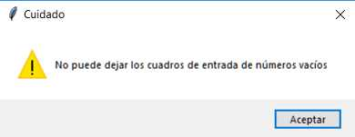


`Ventana de confirmación`

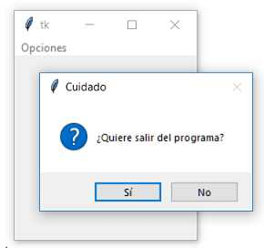

```python
import tkinter as tk
from tkinter import messagebox as mb
import sys

class Aplicacion:
    def __init__(self):
        self.ventana1=tk.Tk()
        self.agregar_menu()
        self.ventana1.mainloop()

    def agregar_menu(self):
        self.menubar1 = tk.Menu(self.ventana1)
        self.ventana1.config(menu=self.menubar1)
        self.opciones1 = tk.Menu(self.menubar1, tearoff=0)
# Cuando se selecciona la opción "Salir" del menú se ejecuta el método 'salir'
        self.opciones1.add_command(label="Salir", command=self.salir)
        self.menubar1.add_cascade(label="Opciones", menu=self.opciones1)    

# En el método 'salir' llamamos a la función 'askyesno' del paquete 'messagebox'
    def salir(self):
        respuesta=mb.askyesno("Cuidado", "¿Quiere salir del programa?")
        if respuesta==True:
            sys.exit()
        

aplicacion1=Aplicacion() 
```
> [!NOTE]
> La función 'askyesno' retorna True o False según cual de los botones se ha presionado. Si retorna True significa que se presionó el botón 'Si'

## tkinter: Ventanas de dialogos
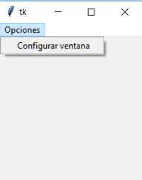

Para crear diálogos en tkinter debemos crear un objeto de la clase TopLevel y pasar como parámetro la referencia de la ventana principal.
Un diálogo se asemeja mucho a lo que es la ventana principal, podemos disponer dentro de la misma objetos de la clase Label, Button, Entry etc.

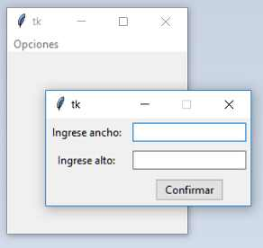

```python
import tkinter as tk
from tkinter import ttk

# Clase que muestra la ventana principal
class Aplicacion:

    def __init__(self):
        self.ventana1=tk.Tk()
        self.agregar_menu()
        self.ventana1.mainloop()

# Metodo para crear el menu
    def agregar_menu(self):
        self.menubar1 = tk.Menu(self.ventana1)
        self.ventana1.config(menu=self.menubar1)
        self.opciones1 = tk.Menu(self.menubar1, tearoff=0)
        self.opciones1.add_command(label="Configurar ventana", command=self.configurar) # cuando se selecciona se dispara el metodo configurar
        self.menubar1.add_cascade(label="Opciones", menu=self.opciones1)    

# Metodo para crear la ventana de dialogo mediante otra clase
    def configurar(self):
        dialogo1 = DialogoTamano(self.ventana1)
        s=dialogo1.mostrar()
        self.ventana1.geometry(s[0]+"x"+s[1]) # Cuando se cierra el diálogo el método 'mostrar' retorna una tupla con los dos valores ingresados por teclado, estos los usamos para dimensionar la ventana principal
        

class DialogoTamano:

    def __init__(self, ventanaprincipal):
# Se crea un diálogo mediante la clase TopLevel que requiera la referencia de la ventana principal
        self.dialogo=tk.Toplevel(ventanaprincipal)

# Se crea todos los controles visuales que tendrá el diálogo (tomar en cuenta que se hace rferncia a la ventana dialogo)
        self.label1=ttk.Label(self.dialogo, text="Ingrese ancho:")
        self.label1.grid(column=0, row=0, padx=5, pady=5)
        self.dato1=tk.StringVar()
        self.entry1=ttk.Entry(self.dialogo, textvariable=self.dato1)
        self.entry1.grid(column=1, row=0, padx=5, pady=5)
        self.entry1.focus()
        self.label2=ttk.Label(self.dialogo, text="Ingrese alto:")
        self.label2.grid(column=0, row=1, padx=5, pady=5)
        self.dato2=tk.StringVar()
        self.entry2=ttk.Entry(self.dialogo, textvariable=self.dato2)
        self.entry2.grid(column=1, row=1, padx=5, pady=5)
        self.boton1=ttk.Button(self.dialogo, text="Confirmar", command=self.confirmar)
        self.boton1.grid(column=1, row=2, padx=5, pady=5)

# El método debe ejecutarse si el operador presiona la 'x' de cerrado del diálogo
        self.dialogo.protocol("WM_DELETE_WINDOW", self.confirmar)
        self.dialogo.resizable(0,0) # no se permite el cambio de tamaño del dialogo con las flechas del mouse
# Mediante la llamada al método 'grab_set' desactivamos los eventos en la ventana principal, es decir que hasta que el operador no cierre el diálogo la ventana principal aparecerá inactiva
        self.dialogo.grab_set()

# El método 'mostrar' hace visible el diálogo y cuando se cierra retorna la tupla
    def mostrar(self):
        self.dialogo.wait_window()
        return (self.dato1.get(), self.dato2.get()) # se retorna los datos que obtuvo la ventana de dialogo

# Cierra el diálogo y permite que finalice el método 'mostrar' retornando los dos enteros (se lanza cuando se presiona el boton 'confirmar' del dialogo)
    def confirmar(self):
        self.dialogo.destroy()


aplicacion1=Aplicacion()
```
## ttk: Control Spinbox
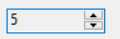

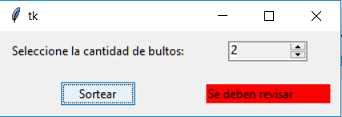

```python
import tkinter as tk
from tkinter import ttk
from tkinter import messagebox as mb
import random

class Aplicacion:
    def __init__(self):
        self.ventana1=tk.Tk()
        self.label1=ttk.Label(self.ventana1, text="Seleccione la cantidad de bultos:")
        self.label1.grid(column=0, row=0, padx=10, pady=10)

# Cuando creamos el Spinbox pasamos el parámetro 'from_' con el valor inicial y el parámetro 'to' con el valor final (el nombre tan extraño de 'from_' se debe a que Python tiene una palabra reservada con dicho nombre)
        self.spinbox1=ttk.Spinbox(self.ventana1, from_=0, to=100, width=10, state='readonly')        
        self.spinbox1.set(0)        # indicamos el valor con el que se muestra el spinbox
        self.spinbox1.grid(column=1, row=0, padx=10, pady=10)
        self.boton1=ttk.Button(self.ventana1, text="Sortear", command=self.sortear)
        self.boton1.grid(column=0, row=1, padx=10, pady=10)
        self.label2=ttk.Label(self.ventana1, text="", width=20)
        self.label2.grid(column=1, row=1, padx=10, pady=10)
        self.ventana1.mainloop()

    def sortear(self):

# Se verifica si el Spinbox tiene el valor cero seleccionado, en caso afirmativo mostramos un mensaje de error
        if int(self.spinbox1.get())==0:
            mb.showerror("Cuidado","Debe seleccionar un valor distinto a cero en bultos")
        else:
            valor=random.randint(1,3)  # En el caso que el operador eligió un valor distinto a cero procedemos a generar un valor aleatorio entre 1 y 3. Según el valor aleatorio generado procedemos a modificar el color de fondo de la label
            if valor==1:
                self.label2.configure(text="Se deben revisar")
                self.label2.configure(background="red")
            else:
                self.label2.configure(text="No se revisan")
                self.label2.configure(background="green")

aplicacion1=Aplicacion()
```

> ![NOTE]
> Tambien se puede agregar el parametro increment para definir cuanto queremos que se incremente cada vez que se presiona el spinbox
> ```python
> self.spinbox1=ttk.Spinbox(self.ventana1, increment=3, from_=1, to=10, state='readonly')
> ```
## tkinter: Scrolled Text
Es necesario importar:
```python
from tkinter import scrolledtext as st
```
ejemplo:
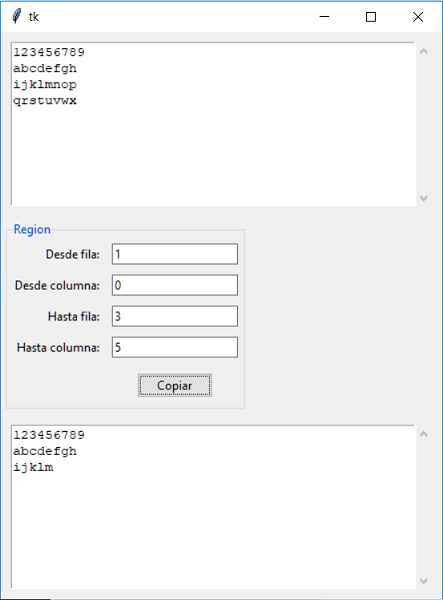

```python
import tkinter as tk
from tkinter import ttk
from tkinter import scrolledtext as st  # Importamos el módulo scrolledtext del paquete tkinter y definimos un alias

class Aplicacion:

# Creamos y ubicamos cada uno de los ScrolledText en el método __init__
    def __init__(self):
        self.ventana1=tk.Tk()
        self.scrolledtext1=st.ScrolledText(self.ventana1, width=50, height=10)
        self.scrolledtext1.grid(column=0,row=0, padx=10, pady=10)
# Separamos en el metodo framecopia la creación de la interfaz visual donde se cargan los 4 valores.
        self.framecopia()        
        self.scrolledtext2=st.ScrolledText(self.ventana1, width=50, height=10)
        self.scrolledtext2.grid(column=0,row=2, padx=10, pady=10)
        self.ventana1.mainloop()


    def framecopia(self):
        self.labelframe1=ttk.LabelFrame(self.ventana1, text="Region")
        self.labelframe1.grid(column=0, row=1, padx=5, pady=5, sticky="w")
        self.label1=ttk.Label(self.labelframe1, text="Desde fila:")
        self.label1.grid(column=0, row=0, padx=5, pady=5, sticky="e")
        self.dato1=tk.StringVar()
        self.entry1=ttk.Entry(self.labelframe1, textvariable=self.dato1)
        self.entry1.grid(column=1, row=0, padx=5, pady=5, sticky="e")
        self.label2=ttk.Label(self.labelframe1, text="Desde columna:")
        self.label2.grid(column=0, row=1, padx=5, pady=5, sticky="e")
        self.dato2=tk.StringVar()
        self.entry2=ttk.Entry(self.labelframe1, textvariable=self.dato2)
        self.entry2.grid(column=1, row=1, padx=5, pady=5, sticky="e")

        self.label3=ttk.Label(self.labelframe1, text="Hasta fila:")
        self.label3.grid(column=0, row=2, padx=5, pady=5, sticky="e")
        self.dato3=tk.StringVar()
        self.entry3=ttk.Entry(self.labelframe1, textvariable=self.dato3)
        self.entry3.grid(column=1, row=2, padx=5, pady=5, sticky="e")
        self.label4=ttk.Label(self.labelframe1, text="Hasta columna:")
        self.label4.grid(column=0, row=3, padx=5, pady=5, sticky="e")
        self.dato4=tk.StringVar()
        self.entry4=ttk.Entry(self.labelframe1, textvariable=self.dato4)
        self.entry4.grid(column=1, row=3, padx=5, pady=5, sticky="e")

        self.boton1=ttk.Button(self.labelframe1, text="Copiar", command=self.copiar)
        self.boton1.grid(column=1, row=4, padx=10, pady=10)

# El método fundamental es el 'copiar'
    def copiar(self):
        iniciofila=self.dato1.get()
        iniciocolumna=self.dato2.get()
        finfila=self.dato3.get()
        fincolumna=self.dato4.get()
# Para extraer cadenas de caracteres de un control ScrolledText debemos llamar la método get y pasar dos String. Por ejemplo si queremos extraer todos los caracteres de la primer fila hasta los 10 primeros caracteres de la tercer fila deberemos codificar
        datos=self.scrolledtext1.get(iniciofila+"."+iniciocolumna, finfila+"."+fincolumna)
# En nuestro problema estos cuatro números los estamos cargando por teclado en los controles Entry.

# Para borrar todo el contenido de un ScrolledText debemos llamar al método delete y pasar estos dos parámetros
        self.scrolledtext2.delete("1.0", tk.END)
# Para insertar en cualquier parte de un ScrolledText empleamos el método insert
        self.scrolledtext2.insert("1.0", datos)
        

aplicacion1=Aplicacion() 
```
## tkinter: Control Canvas
El control Canvas nos permite acceder a una serie de primitivas gráficas: líneas, rectángulos, óvalos, arcos etc. para graficar dentro de la misma

ejemplo1:

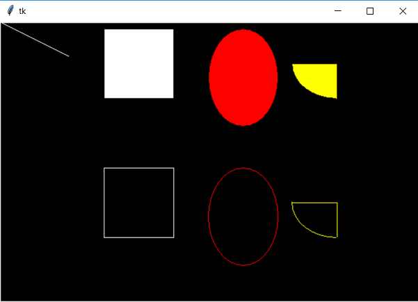

```python
import tkinter as tk    # La clase Canvas se encuentra en el módulo 'tkinter'

class Aplicacion:
    def __init__(self):
        self.ventana1=tk.Tk()

# Creamos un objeto de la clase Canvas y le pasamos en el primer parámetro la referencia a la ventana donde debe agregarse, los dos parámetros siguientes son el ancho y el alto en píxeles, y finalmente el color de fondo de la componente de tipo Canvas
        self.canvas1=tk.Canvas(self.ventana1, width=600, height=400, background="black")
        self.canvas1.grid(column=0, row=0)    # Igual que cualquier otro Widget debemos ubicarlo mediante grid

# Para dibujar una línea la clase Canvas cuenta con el método 'create_line', El primer y segundo parámetro representan la columna y fila donde se inicia la línea (en nuestro ejemplo 0,0) y los otros dos valores representan la columna y fila donde finaliza nuestra línea
        self.canvas1.create_line(0, 0, 100,50, fill="white")

# Para dibujar un rectángulo debemos indicar dos puntos que se encuentren dentro del control Canvas, los dos primeros valores indican el vértice superior izquierdo y los dos siguientes el vértice inferior derecho
        self.canvas1.create_rectangle(150,10, 250,110, fill="white")    # fill rellena el rectangulo de blanco en este caso

# Para dibujar un óvalo los parámetros son idénticos al método 'create_rectangle' con la diferencia que en lugar de dibujar un rectángulo dibuja un óvalo contenido en dicho rectángulo
        self.canvas1.create_oval(300,10,400,150, fill="red")

# Para dibujar un trozo de tarta utilizamos el método 'create_arc', los primeros parámetros son idénticos a los métodos 'create_rectangle' y 'create_oval'. El parámetro start indica a partir de que grado debe comenzar el trozo de arco y mediante el parámetro extent indicamos cuantos grados tiene el trozo de tarta
        self.canvas1.create_arc(420,10,550,110, fill="yellow", start=180, extent=90)

# Para que solo se pinte el perímetro de la figura no pasamos el parámetro fill y pasamos solo el parámetro outline
        self.canvas1.create_rectangle(150,210, 250,310, outline="white")
        self.canvas1.create_oval(300,210,400,350, outline="red")
        self.canvas1.create_arc(420,210,550,310, outline="yellow", start=180, extent=90)        
        self.ventana1.mainloop()
       

aplicacion1=Aplicacion()
```
ejemplo2:

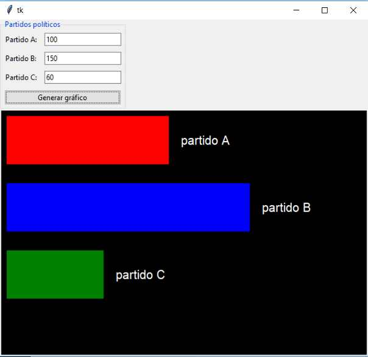

```python
import tkinter as tk
from tkinter import ttk

class Aplicacion:
    def __init__(self):
        self.ventana1=tk.Tk()
# Llamamos al método 'entradadatos' que crea el LabelFrame con los 3 controles Entry, 3 controles Label y el botón:
        self.entradadatos()
        self.canvas1=tk.Canvas(self.ventana1, width=600, height=400, background="black")    # creamos el objeto 'canvas1' y lo ubicamos en la segunda fila
        self.canvas1.grid(column=0, row=1)
        self.ventana1.mainloop()

    def entradadatos(self):
        self.lf1=ttk.LabelFrame(self.ventana1,text="Partidos políticos")
        self.lf1.grid(column=0, row=0, sticky="w")
        self.label1=ttk.Label(self.lf1, text="Partido A:")
        self.label1.grid(column=0,row=0, padx=5, pady=5)
        self.dato1=tk.StringVar()
        self.entry1=ttk.Entry(self.lf1, textvariable=self.dato1)
        self.entry1.grid(column=1, row=0, padx=5, pady=5)
        self.label2=ttk.Label(self.lf1, text="Partido B:")
        self.label2.grid(column=0,row=1, padx=5, pady=5)
        self.dato2=tk.StringVar()
        self.entry2=ttk.Entry(self.lf1, textvariable=self.dato2)
        self.entry2.grid(column=1, row=1, padx=5, pady=5)
        self.label3=ttk.Label(self.lf1, text="Partido C:")
        self.label3.grid(column=0,row=2, padx=5, pady=5)
        self.dato3=tk.StringVar()
        self.entry3=ttk.Entry(self.lf1, textvariable=self.dato3)
        self.entry3.grid(column=1, row=2, padx=5, pady=5)
        self.boton1=ttk.Button(self.lf1, text="Generar gráfico", command=self.grafico_barra)
        self.boton1.grid(column=0, row=3, columnspan=2, padx=5, pady=5, sticky="we")
        self.entry1.focus()

    def grafico_barra(self):
# Cuando se presiona el botón "Generar gráfico" se ejecuta el método 'grafico_barra' donde lo primero que hacemos es borrar el contenido del control de tipo Canvas
        self.canvas1.delete(tk.ALL)

# Recuperamos los tres valores ingresados en los controles Entry y obtenemos el mayor de ellos
        valor1=int(self.dato1.get())
        valor2=int(self.dato2.get())
        valor3=int(self.dato3.get())
        if valor1>valor2 and valor1>valor3:
            mayor=valor1
        else:
            if valor2>valor3:
                mayor=valor2
            else:
                mayor=valor3
        largo1=valor1/mayor*400 # calculamos el largo de la barra: largo=votos del partido/votos del partido con mas votos * 400 píxeles
        largo2=valor2/mayor*400
        largo3=valor3/mayor*400
        self.canvas1.create_rectangle(10,10,10+largo1,90,fill="red")    # dibujo de barras
        self.canvas1.create_rectangle(10,120,10+largo2,200,fill="blue")
        self.canvas1.create_rectangle(10,230,10+largo3,310,fill="green")
        self.canvas1.create_text(largo1+70, 50, text="partido A", fill="white", font="Arial")    # creacion de los textos
        self.canvas1.create_text(largo2+70, 160, text="partido B", fill="white", font="Arial")
        self.canvas1.create_text(largo3+70, 270, text="partido C", fill="white", font="Arial")
        

aplicacion1=Aplicacion()
```
ejemplo3:

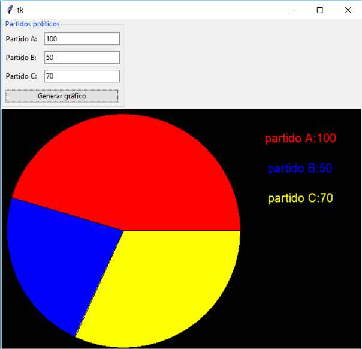

```python
import tkinter as tk
from tkinter import ttk

class Aplicacion:
    def __init__(self):
        self.ventana1=tk.Tk()
        self.entradadatos()
        self.canvas1=tk.Canvas(self.ventana1, width=600, height=400, background="black")
        self.canvas1.grid(column=0, row=1)
        self.ventana1.mainloop()

    def entradadatos(self):
        self.lf1=ttk.LabelFrame(self.ventana1,text="Partidos políticos")
        self.lf1.grid(column=0, row=0, sticky="w")
        self.label1=ttk.Label(self.lf1, text="Partido A:")
        self.label1.grid(column=0,row=0, padx=5, pady=5)
        self.dato1=tk.StringVar()
        self.entry1=ttk.Entry(self.lf1, textvariable=self.dato1)
        self.entry1.grid(column=1, row=0, padx=5, pady=5)
        self.label2=ttk.Label(self.lf1, text="Partido B:")
        self.label2.grid(column=0,row=1, padx=5, pady=5)
        self.dato2=tk.StringVar()
        self.entry2=ttk.Entry(self.lf1, textvariable=self.dato2)
        self.entry2.grid(column=1, row=1, padx=5, pady=5)
        self.label3=ttk.Label(self.lf1, text="Partido C:")
        self.label3.grid(column=0,row=2, padx=5, pady=5)
        self.dato3=tk.StringVar()
        self.entry3=ttk.Entry(self.lf1, textvariable=self.dato3)
        self.entry3.grid(column=1, row=2, padx=5, pady=5)
        self.boton1=ttk.Button(self.lf1, text="Generar gráfico", command=self.grafico_tarta)
        self.boton1.grid(column=0, row=3, columnspan=2, padx=5, pady=5, sticky="we")
        self.entry1.focus()

# En el método grafico_tarta lo primero que hacemos es borrar el contenido del control Canvas
    def grafico_tarta(self):
        self.canvas1.delete(tk.ALL)
# Extraemos los tres valores ingresados en los controles Entry
        valor1=int(self.dato1.get())
        valor2=int(self.dato2.get())
        valor3=int(self.dato3.get())
        suma=valor1+valor2+valor3    # Sumamos la cantidad total de votos de los tres partidos
        grados1=valor1/suma*360    # calculo de los tres trozos
        grados2=valor2/suma*360
        grados3=valor3/suma*360
        self.canvas1.create_arc(10,10,400,400,fill="red", start=0, extent=grados1)    # se grafica mediante la primitiva 'create_arc'
        self.canvas1.create_arc(10,10,400,400,fill="blue", start=grados1, extent=grados2)
        self.canvas1.create_arc(10,10,400,400,fill="yellow", start=grados1+grados2, extent=grados3)        
        self.canvas1.create_text(500, 50, text="partido A:"+str(valor1), fill="red", font="Arial")    # se crea los textos
        self.canvas1.create_text(500, 100, text="partido B:"+str(valor2), fill="blue", font="Arial")
        self.canvas1.create_text(500, 150, text="partido C:"+str(valor3), fill="yellow", font="Arial")
        

aplicacion1=Aplicacion()
```
