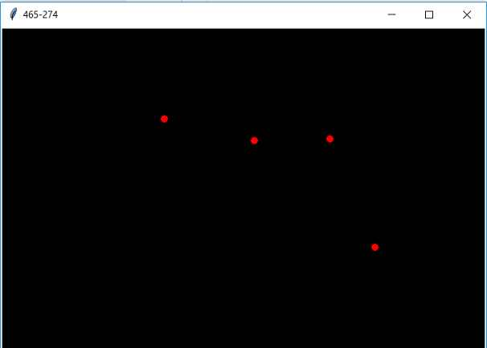
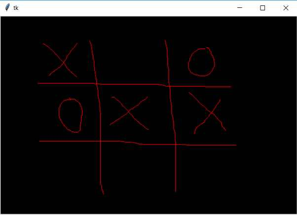
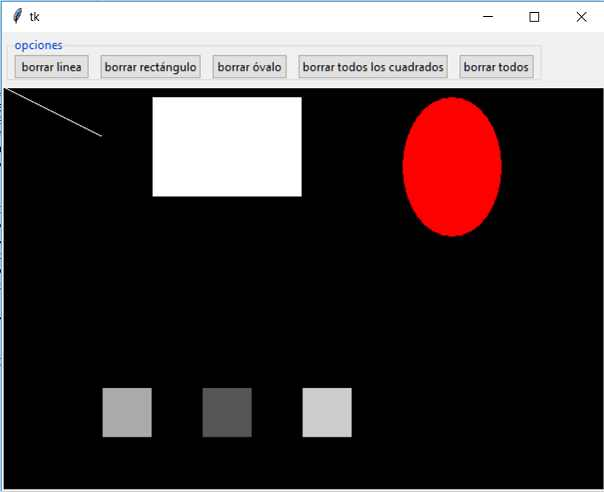
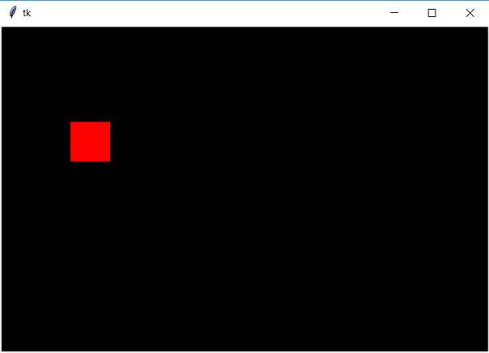
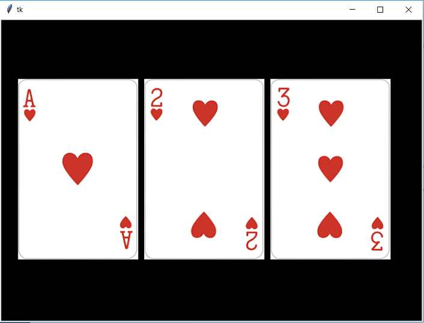
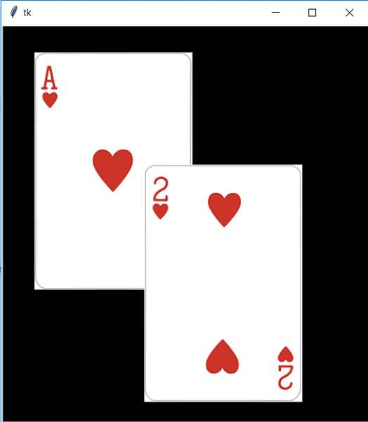

# Canvas

## Captura de eventos del mouse


```python
import tkinter as tk

class Aplicacion:
    def __init__(self):
        self.ventana1=tk.Tk()
# Luego de crear el objeto de la clase Canvas procedemos a llamar al método bind e indicar el nombre de evento a capturar y el método que lo capturará
        self.canvas1=tk.Canvas(self.ventana1, width=600, height=400, background="black")
        self.canvas1.bind("<Motion>", self.mover_mouse)  # la captura del desplazamiento de la flecha del mouse debemos especificar 'Motion'
        self.canvas1.bind("<Button-1>", self.presion_mouse)  # la presión del botón izquierdo del mouse debemos especificar ''Button-1'

        self.canvas1.grid(column=0, row=1)
        self.ventana1.mainloop()

# El método 'presion_mouse' se dispara cuando presionamos el botón izquierdo del mouse dentro del objeto canvas1. Dibujamos un círculo teniendo en
# cuenta donde se encuentra la flecha del mouse en este momento
    def presion_mouse(self, evento):
        self.canvas1.create_oval(evento.x-5,evento.y-5,evento.x+5,evento.y+5, fill="red")

# Cada vez que se produce un desplazamiento de la flecha del mouse dentro de la componente canvas1 se ejecuta el método 'mover_mouse'
    def mover_mouse(self, evento):        
        self.ventana1.title(str(evento.x)+"-"+str(evento.y))

aplicacion1=Aplicacion()
```

> [!NOTE]
> La diversidad de eventos que podemos capturar es muy grande, veamos algunos ejemplos:
> - Para capturar el evento clic del botón izquierdo del mouse indicamos en el método bind <Button-1>, el botón central <Button-2> y el botón derecho del mouse <Button-3>
> - Si necesitamos capturar el evento clic del botón derecho del mouse y a su vez que se encuentre presionada la tecla Shift tenemos que codificar:
> ```python
> self.canvas1.bind("<Shift Button-1>", self.presion_mouse)
> ```
> En lugar de Shift podemos verificar si se está presionando la tecla control:
> ```python
> self.canvas1.bind("<Control Button-1>", self.presion_mouse)
> ```
> Inclusive detectar el evento si se presiona Shift, Control y el botón izquierdo del mouse:
> ```python
> self.canvas1.bind("<Control Shift Button-1>", self.presion_mouse)
> ```
> La tecla Alt, Shift, Control y el botón izquierdo del mouse:
> ```python
> self.canvas1.bind("<Control Shift Alt Button-1>", self.presion_mouse)
> ```
> - Si necesitamos hacer algo cuando la flecha del mouse entra al control podemos plantear la captura del evento:
> ```python
> self.canvas1.bind("<Enter>", self.entrada)
> ```
> Y si queremos detectar cuando la flecha del mouse sale de la componente:
> ```python
> self.canvas1.bind("<Leave>", self.salida)
> ```
> - Para detectar el doble clic de un botón del mouse:
> ```python
> self.canvas1.bind("<Double-Button-1>", self.presion_mouse)
> ```



```python
import tkinter as tk

class Aplicacion:

    def __init__(self):
        self.ventana1=tk.Tk()
        self.canvas1=tk.Canvas(self.ventana1, width=600, height=400, background="black")
        self.canvas1.grid(column=0,row=0)
# Para poder dibujar a mano alzada vamos a identificar los eventos cuando se presiona el botón izquierdo del mouse
        self.canvas1.bind("<ButtonPress-1>",self.boton_presion)
        self.canvas1.bind("<Motion>", self.mover_mouse)    # cuando se mueve el mouse dentro del control Canvas
        self.canvas1.bind("<ButtonRelease-1>",self.boton_soltar)    # cuando se suelta el botón izquierdo del mouse:
        self.presionado=False
        self.ventana1.mainloop()

# Cuando se presiona el botón izquierdo del mouse se cambia el estado de la bandera 'presionado' y se definen los atributos origenx y
# origeny con la coordenada actual de la flecha del mouse
    def boton_presion(self, evento):
        self.presionado=True
        self.origenx=evento.x
        self.origeny=evento.y
# cuando 'presionado' tiene un valor 'True' se pasa a dibujar una línea desde la coordenada donde se encontraba la flecha del mouse cuando se lo presionó y
# la nueva coordenada, también actualizamos la coordenada origenx y origeny con la nueva posición
    def mover_mouse(self, evento):
        if self.presionado:
            self.canvas1.create_line(self.origenx,self.origeny,evento.x,evento.y, fill="red")
            self.origenx=evento.x
            self.origeny=evento.y

# El método boton_soltar se ejecuta cuando el operador deja de presionar el botón izquierdo del mouse, donde volvemos a disponer el atributo 'presionado'
# con el valor 'False', lo que hace que cuando se mueve la flecha del mouse no se dibuje la línea
    def boton_soltar(self,evento):
        self.presionado=False

aplicacion1=Aplicacion()
```

## Borrar figuras mediante Ids y Tags


```python
import tkinter as tk
from tkinter import ttk

class Aplicacion:
    def __init__(self):
        self.ventana1=tk.Tk()
        self.crear_botones()
        self.canvas1=tk.Canvas(self.ventana1, width=600, height=400, background="black")
        self.canvas1.grid(column=0, row=1)

# Las tres primeras figuras que creamos almacenamos en atributos de la clase la referencia a las mismas
        self.linea=self.canvas1.create_line(0, 0, 100,50, fill="white")        
        self.rectangulo=self.canvas1.create_rectangle(150,10, 300,110, fill="white")
        self.ovalo=self.canvas1.create_oval(400,10,500,150, fill="red")

# Los tres cuadrados que creamos definimos el parámetro tag con el string "cuadrado"
        self.canvas1.create_rectangle(100,300,150,350,fill="#aaaaaa", tag="cuadrado")
        self.canvas1.create_rectangle(200,300,250,350,fill="#555555", tag="cuadrado")
        self.canvas1.create_rectangle(300,300,350,350,fill="#cccccc", tag="cuadrado")

        self.ventana1.mainloop()

# El método 'crear_botones' tiene solo el objetivo de crear los 5 botones que necesita la aplicación y los agrupa en un LabelFrame
    def crear_botones(self):
        self.labelframe1=ttk.LabelFrame(self.ventana1,text="opciones")
        self.labelframe1.grid(column=0, row=0, sticky="w", padx=5, pady=5)
        self.boton1=ttk.Button(self.labelframe1, text="borrar linea", command=self.borrar_linea)
        self.boton1.grid(column=0, row=0, padx=5)
        self.boton2=ttk.Button(self.labelframe1, text="borrar rectángulo", command=self.borrar_rectangulo)
        self.boton2.grid(column=1, row=0, padx=5)
        self.boton3=ttk.Button(self.labelframe1, text="borrar óvalo", command=self.borrar_ovalo)
        self.boton3.grid(column=2, row=0, padx=5)
        self.boton4=ttk.Button(self.labelframe1, text="borrar todos los cuadrados", command=self.borrar_cuadrados)
        self.boton4.grid(column=3, row=0, padx=5)
        self.boton5=ttk.Button(self.labelframe1, text="borrar todos", command=self.borrar_todos)
        self.boton5.grid(column=4, row=0, padx=5)

# Cuando se presiona el botón de borrar la línea se llama al método delete de la clase Canvas pasando el atributo que almacena la referencia a la línea creada
    def borrar_linea(self):
        self.canvas1.delete(self.linea)
# De forma similar se procede a borrar el rectángulo y el óvalo mediante la referencia del Id:
    def borrar_rectangulo(self):
        self.canvas1.delete(self.rectangulo)

    def borrar_ovalo(self):
        self.canvas1.delete(self.ovalo)
# Para eliminar todos los cuadrados también llamamos al método delete y le pasamos el string que almacenamos en su tag
    def borrar_cuadrados(self):
        self.canvas1.delete("cuadrado")
# Finalmente para borrar todos las figuras que tiene un control Canvas debemos llamar a delete y pasar la variable ALL que define el módulo tkinter
    def borrar_todos(self):
        self.canvas1.delete(tk.ALL)

aplicacion1=Aplicacion()
```

## Desplazar una figura mediante el método move


```python
import tkinter as tk

class Aplicacion:
    def __init__(self):
        self.ventana1=tk.Tk()
# Creamos un objeto de la clase Canvas de 600 píxeles de ancho por 400 de alto
        self.canvas1=tk.Canvas(self.ventana1, width=600, height=400, background="black")
        self.canvas1.grid(column=0, row=0)
# Creamos un cuadrado de color rojo y guardamos su referencia en el atributo 'cuadrado'
        self.cuadrado=self.canvas1.create_rectangle(150,10,200,60, fill="red")
# Ponemos a escuchar el evento 'KeyPress' e indicamos el método a ejecutar en caso que se dispare
        self.ventana1.bind("<KeyPress>", self.presion_tecla)
        self.ventana1.mainloop()

# En el método 'presion_tecla' verificamos cual de las cuatro teclas de flecha se ha presionado y llamamos al método 'move' de la clase Canvas,
# debemos pasar la referencia de la figura y cuantos píxeles se debe desplazar en 'x' e 'y'
    def presion_tecla(self, evento):
        if evento.keysym=='Right':
            self.canvas1.move(self.cuadrado, 4, 0)
        if evento.keysym=='Left':
            self.canvas1.move(self.cuadrado, -4, 0)
        if evento.keysym=='Down':
            self.canvas1.move(self.cuadrado, 0, 4)
        if evento.keysym=='Up':
            self.canvas1.move(self.cuadrado, 0, -4)


aplicacion1=Aplicacion()
```

## Mostrar una imagen


```python
import tkinter as tk

class Aplicacion:
    def __init__(self):
        self.ventana1=tk.Tk()
# Creamos una componente Canvas de 700 píxeles de ancho por 500 píxeles de alto, sabiendo que los archivos de las cartas tienen un tamaño de 200*300 píxeles
        self.canvas1=tk.Canvas(self.ventana1, width=700, height=500, background="black")
        self.canvas1.grid(column=0, row=0)

# Creamos un objeto de la clase PhotoImage y le pasamos como parámetro el nombre del archivo a leer del disco duro
# (el archivo 'carta1.png' se debe encontrar en la misma carpeta que nuestro programa de Python, sino debemos indicar el path)
        archi1=tk.PhotoImage(file="carta1.png")

# Seguidamente llamamos al método 'create_image' de la clase Canvas y le pasamos la columna y la fila donde debe mostrarse la imagen,
# en el parámetro image le pasamos la referencia del archivo que acabamos de leer
        self.canvas1.create_image(30, 100, image=archi1, anchor="nw")

        archi2=tk.PhotoImage(file="carta2.png")
        self.canvas1.create_image(240, 100, image=archi2, anchor="nw")
        archi3=tk.PhotoImage(file="carta3.png")
        self.canvas1.create_image(450, 100, image=archi3, anchor="nw")
        self.ventana1.mainloop()
       

aplicacion1=Aplicacion()
```
> [!NOTE]
> El parámetro anchor es importante que lo inicialicemos con el valor "nw" (north, west) para que el vértice superior izquierdo se muestre en la coordenada (30,100)
> Por defecto el parámetro anchor tiene el valor "center".
>
> Los valores posibles del parámetro anchor son: "n", "ne", "e", "se", "s", "sw", "w", "nw" y "center"


> [!TIP]
> Los formatos reconocidos de la clase PhotoImage son: GIF, PNG, PGM y PPM.
> Si el archivo se encuentra en otra carpeta debemos indicar el path del mismo:
> ```python
> archi1=tk.PhotoImage(file="C:/programaspython/carta1.png")
> ```


## Mover una figura


```python
import tkinter as tk

class Aplicacion:
    def __init__(self):
        self.ventana1=tk.Tk()
# Creamos primero el control de tipo Canvas y las dos imágenes respectivas. A cada una de las imágenes iniciamos el parámetro 'tags' con un valor
        self.canvas1=tk.Canvas(self.ventana1, width=900, height=500, background="black")
        self.canvas1.grid(column=0, row=0)
        archi1=tk.PhotoImage(file="carta1.png")
        self.canvas1.create_image(30, 100, image=archi1, anchor="nw", tags="movil")
        archi2=tk.PhotoImage(file="carta2.png")
        self.canvas1.create_image(400, 100, image=archi2, anchor="nw", tags="movil")

# Mediante el método 'tag_bind' de la clase Canvas enlazamos el evento de presión del botón izquierdo para todas las figuras que tienen el tag con el valor 'movil'
        self.canvas1.tag_bind("movil", "<ButtonPress-1>", self.presion_boton)

# De forma idéntica hacemos la captura del desplazamiento del mouse
        self.canvas1.tag_bind("movil", "<Button1-Motion>", self.mover)

# Inicializamos el atributo 'carta_seleccionada' con el valor None, indicando que ninguna de las cartas se ha hecho clic sobre la misma
        self.carta_seleccionada = None

        self.ventana1.mainloop()

# Cuando se presiona el botón izquierdo sobre alguna de las cartas se extrae mediante el método 'find_withtag' la referencia de la carta presionada
# y se guarda en el atributo 'carta_seleccionada' una tupla que contiene la carta que se acaba de presionar y la coordenada x e y actual
    def presion_boton(self, evento):
        carta = self.canvas1.find_withtag(tk.CURRENT)
        self.carta_seleccionada = (carta, evento.x, evento.y)

# Cuando se mueve la flecha del mouse extraemos del atributo 'carta_seleccionada' la carta que se había presionado y su coordenada,
# procedemos a desplazarla mediante el método 'move' y guardamos la nueva posición de la carta
    def mover(self, evento):
        x, y = evento.x, evento.y
        carta, x1, y1 = self.carta_seleccionada
        self.canvas1.move(carta, x - x1, y - y1)
        self.carta_seleccionada = (carta, x, y)    

aplicacion1=Aplicacion()
```
